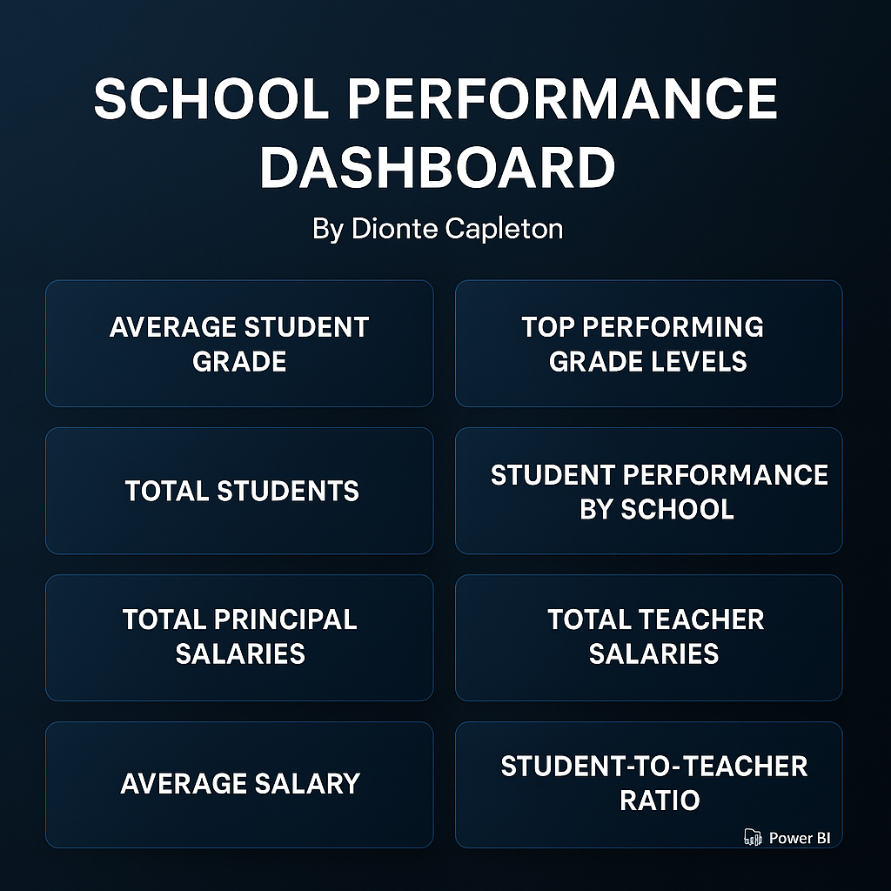

# school-performance-dashboard
End-to-end school analysis using Oracle SQL, Python, and Power BI
# School Performance Dashboard  
**Created by Dionte Capleton**

This project explores academic and salary insights across schools using Oracle SQL, Python (Pandas), and Power BI. It is an interactive Power BI dashboard project that analyzes school performance, staffing, and salary patterns using data from a normalized Oracle database schema.

---

## 📂 Folder Structure
- `PowerBI/`: `.pbix` dashboard file  
- `SQL/`: Queries used to extract and join data  
- `Python/`: Jupyter notebook for data cleaning and CSV export  
- `images/`: Dashboard thumbnail and screenshots  
- `data/`: Cleaned CSV datasets  
    - `classroom_students_cleaned.csv`  
    - `classrooms_cleaned.csv`  
    - `people_cleaned.csv`  
    - `principals_cleaned.csv`  
    - `schools_cleaned.csv`  
    - `students_cleaned.csv`  
    - `subjects_cleaned.csv`  
    - `teachers_cleaned.csv`  

---

## 🔑 Key Insights
- Schools with smaller class sizes perform better academically.  
- Fayetteville-Manlius leads in performance and warrants budget prioritization.  
- Disparity exists between performance and salary allocation, highlighting retention risks.  

---

## 💡 Business Problem Tackled
*Which school should receive a budget increase to improve academic performance and sustain staff retention?*

---

## 📸 Dashboard Preview  

---

## 🧠 How to Use
1. Open the `.pbix` file in Power BI **or** the `school_vis.pdf` preview.  
2. Explore visuals and filter by school or grade level.  
3. Reference SQL scripts to understand the data joins and structure.  

---

## ⚙️ Tech Stack
- **SQL**: Data extraction and joins (Oracle syntax)  
- **Python (Pandas)**: Data cleaning and formatting  
- **Power BI**: Visualization and KPI analysis  

